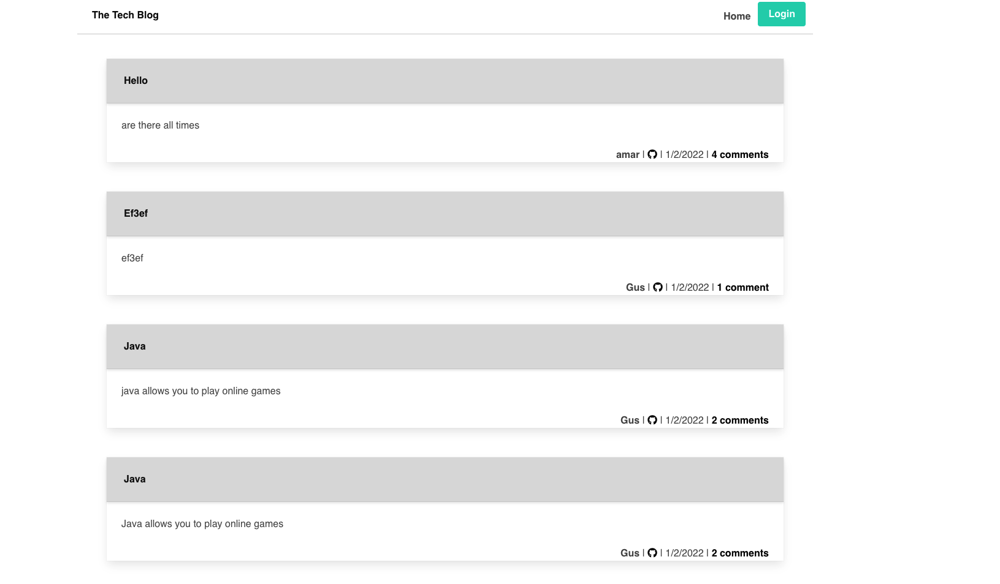
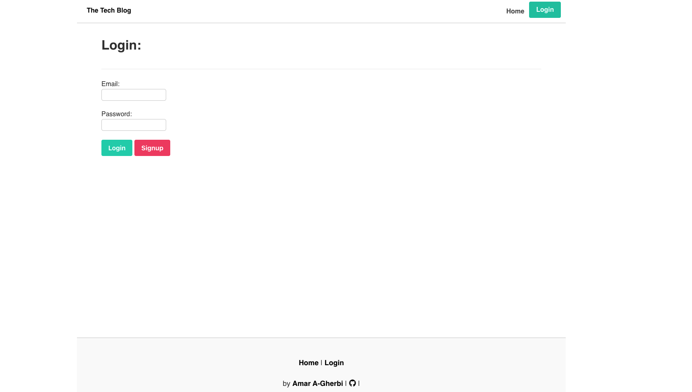
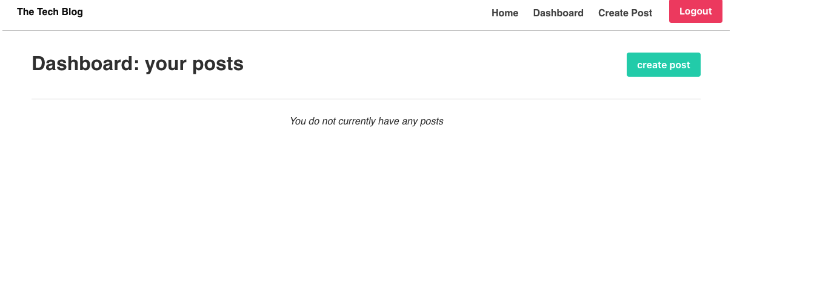
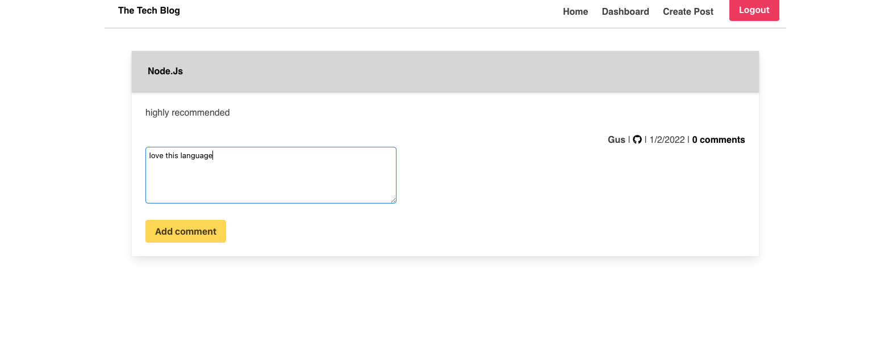

# The-Tech_Blog
* Description
* Installations
* Licence
* Contributing
* Contributing
* User Story
* Demo Video

* Questions

# Description
 A mysql database and CMS-style Blog built using Model View Controller  paradigm. Built using MySQL2, Express, Sequelize,  Handlebars and dotenv.
# Installations
` express`
   `npm init -y`
   `express-handlebars`
   `npm i mysql`
   `npm i sql`
   `npm i mysql2`
   `express-session`
   `connect-session-sequelize`
   

# Contributing 
A work in progress. And the possibilities are endless.
Please feel free to submit any code updates for review and acceptance.

* 

# User-Story

 # Licensese 
 * 
 # Screenshots:
 * 
 * 
 * 
 * 
 

 # Project Demo Video
 * [Demo](https://watch.screencastify.com/v/lcMPPsX2ez4aQHgCb15o)
 # Questions
 please feel free to ask me any questions.

 * augustine2903a@gmail.com